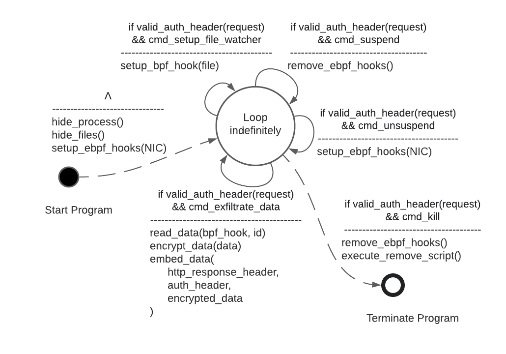
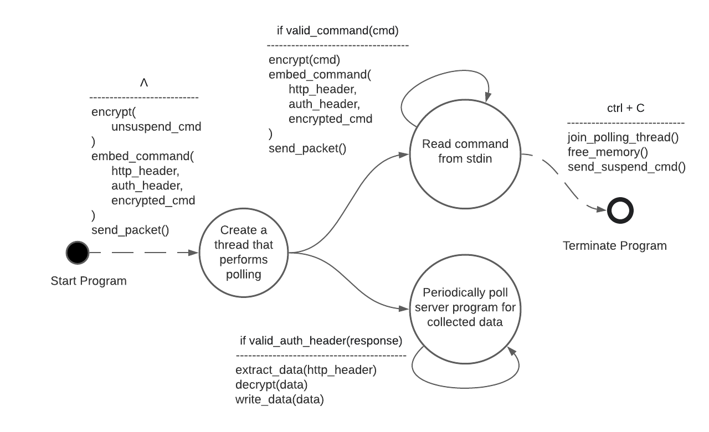

# overview
cat soup is a rootkit developed to explore offensive capabilities using eBPF, its name was inspired by an animated film based on the manga created by Nekojiru. the rootkit consists of two components:
1. server (nyako)
2. client (nyatta)

for the details see documents/design.pdf and documents/manual.pdf.

## diagrams
### state diagram of nyako

### state diagram of nyatta

